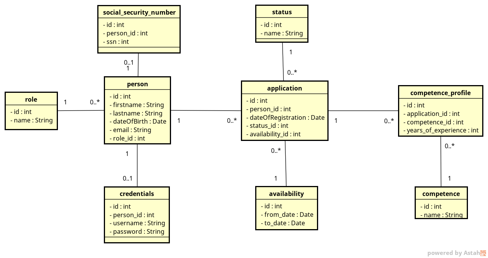
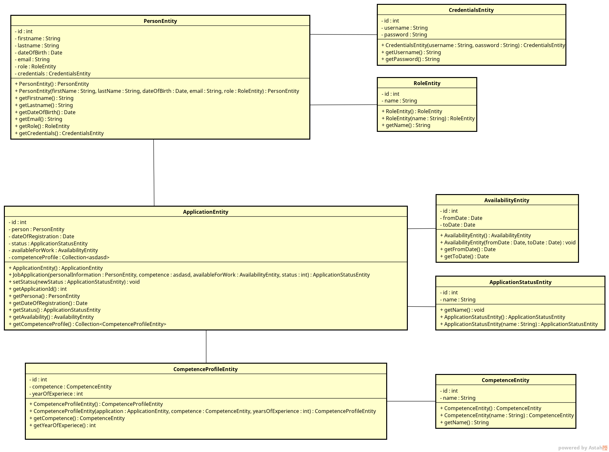

# Architecture Documentation
## The Recruiting Application
### Team
Adrian Gortzak <br/>
AlAlAlAlAlbin Friedner <br/>
Alexander Nikalayeu nikal@kth.se

### Introduction
In this document the architecture for the recruit system we have developed is explained. The document will describe
the features and properties as well as the decisions behind them. We also explain considerations we have made before 
the decision of a solution. Non-functional requirements and possible unsolved issues is also described.

### Functionality View
What user can do at this stage? <br/>
User can register them selves.


### Design View
##### Architecture choice
This application is implemented as microservices distributed-system. Microservices architecture means separately deployed 
units and each unit(microservice) has it own objective. Reasons for choosing microservices pattern are: 
- High cohesion and low coupling - all parts of the system are maximum decoupled, every microservice has it own objective 
and can exist on their own
- High scalability and ease of deployment - since all parts of the system are decoupled each microservice can be deployed 
in any numbers if needed which makes better use of hardware resources than monotolic application 
- Easy to maintain and continue development - each team can independently work on their particular microseviceservice as 
long as everyone is following agreed public API
- Good testability - decoupled parts are simple to test since every test can be targeted for a specific code without any dependencies on other services


##### Topology choice
There are several topologies of microservices. I this case we implement API-REST-based topology. API-REST-based topology 
means that clients request goes thought public API and API is talking to fine-grained independent microservices using REST-based interface.


##### Design choices
###### Client-side load balancing
This system is using client-side balancing. That means that all clients(services that need other services) are keeping track of which instance of a service to ask. One alternative
would be a centralized load-balancing where one service is a load balanser and other services would go thought it to get to other services. That could create bottlenecks. Client-side 
load balancing solves that problem.
<br/>
<br/>
We are using Ribbon as load balancer. It is also used by Zuul Gateway by default.

###### Redis for POST-requests
This system is using Redis message broker for any "write" requests. That is used to make sure that no requests that are changing state are lost due to a down service.

### Security View
##### Security issues considered
- Authentication on each service and different access level/roles
- Accessing services without gateway
- Encrypting all client-traffic
- Access to config files

###### Authentication on each service and different access level/roles
Since the system is decoupled in independent services, each of them has to authenticate user requests. We are going to use 
OAuth2 and tokens(possibly JWT). That means that each client request will have a header containing a token, when request hits a service,
the service will take the token and ask an authentication service if a given token is valid and level of authorization. O

###### Accessing service without gateway
A simple way to make sure that services are only accessible trought gateway is to have all services on same network and give all services, except gateway, local ip-address.

###### Encrypting all client-traffic
Self-seined certificate and HTTPS.

###### Access to config files
Access to config files is restricted and only config service has credentials. In future, information in config-files can be encrypted.

### Data View
There are two data sources for this project. The first one, used at runtime, is a mysql server. It is accessible from anywhere on the internet by username, password and the non standard port. The second database is an embedded h2 server meant for testing so we don't change the real data during a test. Both databases have the same structure (see picture 3). In the application we make transactions to one or more specific
 parts of the database by repository (see picture 1). The data retrieved will be handled as entities, objects that represent the database and also has the connections that the database has. 

```java
@Transactional
public interface CompetenceProfileRepository extends CrudRepository<CompetenceProfileEntity, Integer> {
}
```
1. repository
<br/>

2. Database design
<br/>

3. OR-mapping

#### Old SSN to new dateOfBirth
In old system SSN were entered by applicants and in the new system date of birth will be used
instead. New database will be redesigned but old data cannot be lost. Solution is to create a new 
db table where persons id is a foreign key to the person and SSN store in SSN column. 


### Deployment View
#### Microservices in the system
###### Edge service
Edge service is gatewey för this system. That is were all client request goes trought. We are using Spring Cloud Netflix projects to implement this. Netflix Zuul as gateway 
since it is a reliable easy to use gateway library that also implements load balancer and circuit breaker design pattern so we do not have to do it manually. 

###### Configuration Service
Configuration Service is one of the core components in this system. This service holds configuration for all services and keys for all shared resources.
Reason to use Configuration Service is that our system uses a database and we will have only one physical DB. Every DB have 
a location and credentials and so on. If we would for example move the DB - then we would have to change information on all services and also restart all of then.
To prevent that configuration service will have all configuration and services will as it for configuration information. Also, services will be
able to update their configuration on run-time.
<br/>
<br/>
Configuration service also will be secured so security of credentials and other sensitive information will be handled at one place.

###### Eureka Discovery Service
Eureka is an discovery service developed by Netflix and used by services to find each other. The idea is that to make services independent from ip-addresses and ports. 
<br/>
<br/>
Problem is that when new service is added or some service got scaled(deployed on several nodes), all services has to get some kind of reference to be able to use newly deployed service.
Since this is a distributed system - ip-addresses and ports are the references. But it would be a lot of work, if not imposable, to keep track of all services and their addresses and 
give list of services to other services manually.
<br/>
<br/>
That is why when new service is being deployed it will register it self on discovery service under a certain name. Then all services inside the system will be able 
to call this service by name, not ip-address and port. If several instances of same service is up them load balanser can easily find one that is best suited to perform the task. 

###### Redis Service
Redis will de used as message broker. Idea is to use Redis in future stage for POST requests - so that no POST request will be lost due to a down service.

###### Authentication Service
Authentication service will provide tokens and check if they are valid. 

###### Registration Service
Registration service will perform registration of new users. This service has a REST API that accepts HTTP POST requests from
a form on the client side. The form input is validated by the service and persisted in a database. The service is also 
 going to assign the role 'Applicant' to each new user that registers. Later on Redis will be configured.


###### JobApplication Service
Job application service will handle all interactions with the job applications. it has a RESTapi and is used to create new applications, updating application statuses by a recruiter after being looked over, retrieving a single application or a list of applications in a more page-like form, filtering applications by parameters and storing everything consistently. 

### Implementation View
###### Creation
All services are implemented as Maven projects using Spring Framework with Spring Boot, Spring Cloud, Spring Data and other Spring projects.
<br/>
<br/>

###### Building and deployment
Services are build by Maven and packaged as JAR files. Then JAR files are putted in Docker images. 
To automate the process Maven Docker plugin is used to build JARS and build Docker images. Maven Docker
Plugin also deploys image to given Docker environment.
Also commands for building are putted into a bash script. 

###### Running application
Running commands are putted in a script to start all services.

### Problems

### References


#### Tools, frameworks and libraries:
- Spring Framework with Spring Boot, Spring Cloud, Spring Security and more Spring projects - main development framework
- Maven - for dependency managing, test running, building docker images 
- JUnit 4/5 - testing framework
- Spring Test and Mockito - testing framework
- Netflix Eureka - discovery service so that services can find each other
- Netflix Hystrix - implementation circuit breaker design patternr that handles situation when service is unavailable
- Netflix Ribbon - client side load balancer that knows which servers are up and available
- Redis - used as message broker between services to make sure that no messages dissapear due to down server
- Docker - packeting and deployment tool
- AngularJS - client side model