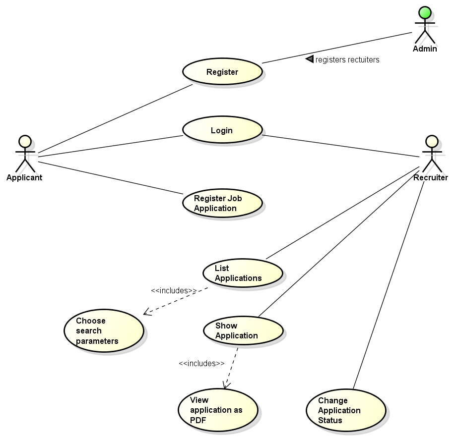
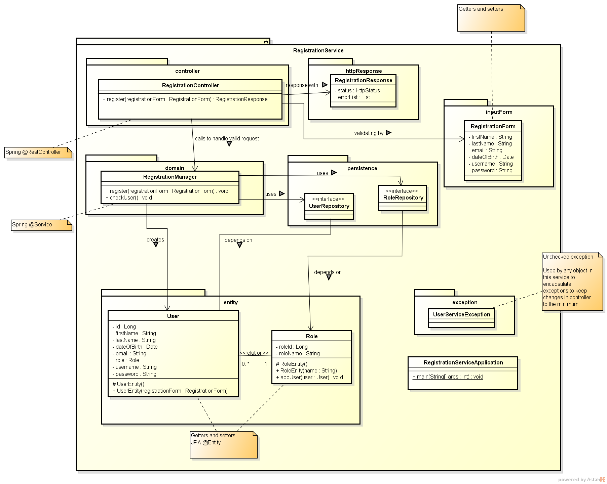
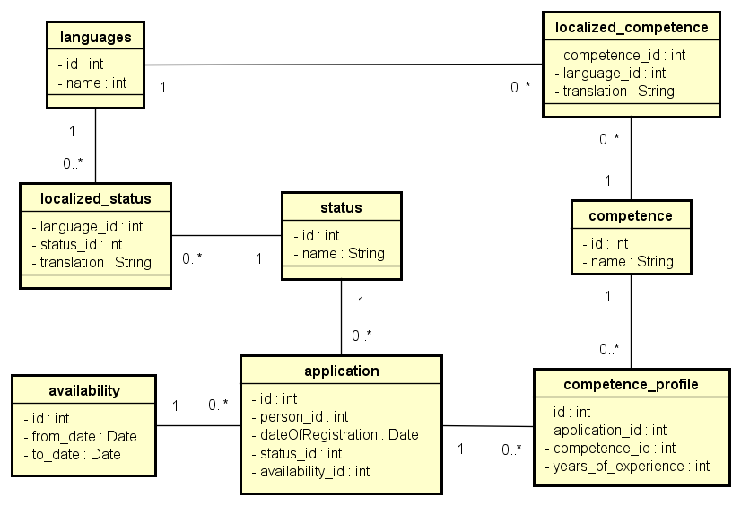
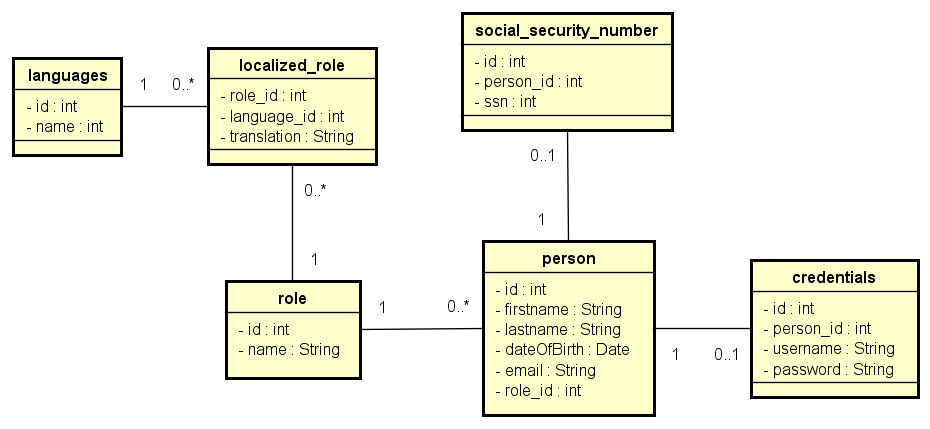
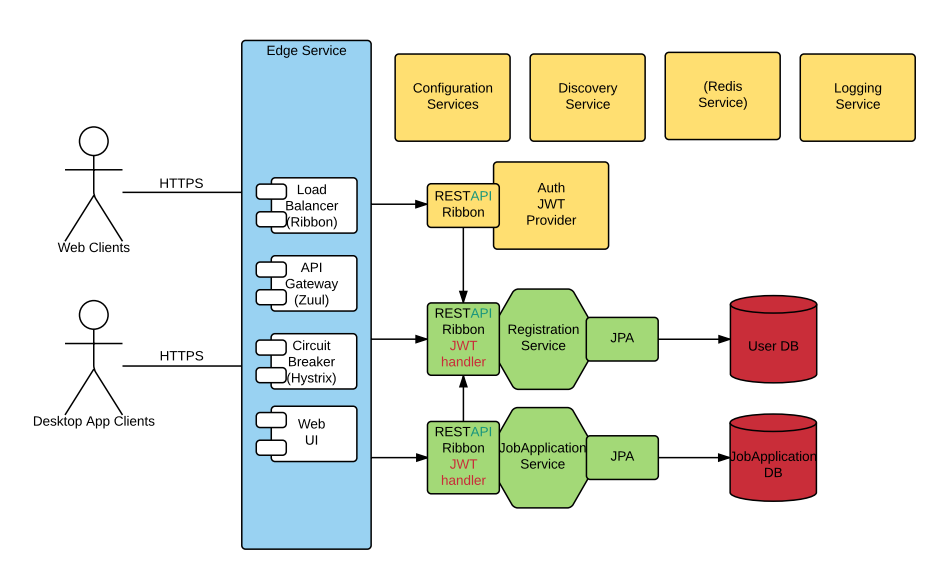

# Architecture Documentation
## The Recruiting Application
### Team

|Name | Email|
------------ | -------------
| **Adrian Gortzak** | gortzak@kth.se |
|**Albin Friedner** | friedner@kth.se
|**Alexander Nikalayeu** | nikal@kth.se |

### Table of content
1. [<b>Introduction</b>](#introduction)
2. [<b>Functional view</b>](#functionality_view)
3. [<b>Design view</b>](#design_view)
4. [<b>Security</b>](#security_view)
5. [<b>Data view</b>](#data_view)
6. [<b>Non-Functional View</b>](#non_func_view)
7. [<b>Deployment view</b>](#deployment_view)
8. [<b>Implementation View</b>](#implementation_view)
9. [<b>Problems</b>](#problems)

 ### 1. Introduction <a href = "#introduction"/> 
In this document the architecture for the recruit system we have developed is explained. The document will describe
the features and properties as well as the decisions behind them. We also explain considerations we have made before 
the decision of a solution. Non-functional requirements and possible unsolved issues is also described.

### 2. Functionality View <a href = "#functionality_view"/> 

[Requirments from product owner](project-task.pdf)


2.1 use cases

This use case diagram shows that there are several actors and all they have different functionality. 

### 3. Design View <a href = "#design_view"/> 
##### Architecture choice
This application is implemented as microservices distributed-system. Microservices architecture means separately deployed 
units and each unit(microservice) has it own objective[1]. Reasons for choosing microservices pattern are: 
- High cohesion and low coupling - all parts of the system are maximum decoupled, every microservice has it own objective 
and can exist on their own [2]
- High scalability and ease of deployment - since all parts of the system are decoupled each microservice can be deployed 
in any numbers if needed which makes better use of hardware resources than monotolic application [2]
- Easy to maintain and continue development - each team can independently work on their particular microseviceservice as 
long as everyone is following agreed public API [2]
- Good testability - decoupled parts are simple to test since every test can be targeted for a specific code without any dependencies on other services [2]


##### Topology choice
There are several topologies of microservices. I this case we implement API-REST-based topology. API-REST-based topology 
means that clients request goes thought public API and API is talking to fine-grained independent microservices using REST-based interface. [3]


##### Design choices
###### Client-side load balancing
This system is using client-side balancing. That means that all clients(services that need other services) are keeping track of which instance of a service to ask. One alternative
would be a centralized load-balancing where one service is a load balancer and other services would go thought it to get to other services. That could create bottlenecks. Client-side 
load balancing solves that problem. [4]
<br/>
<br/>
We are using Ribbon as load balancer. It is also used by Zuul Gateway by default.

###### Redis for POST-requests
This system is using Redis message broker for any "write" requests. That is used to make sure that no requests that are changing state are lost due to a down service.

#### Microservices in the system
###### Edge service
Edge service is gateway för this system. That is were all client request goes thought. We are using Spring Cloud Netflix projects to implement this. Netflix Zuul as gateway 
since it is a reliable easy to use gateway library that also implements load balancer and circuit breaker design pattern so we do not have to do it manually. [5]

###### Configuration Service
Configuration Service is one of the core components in this system. This service holds configuration for all services and keys for all shared resources.
Reason to use Configuration service is that our system uses a database and we will have only one physical DB. Every DB have 
a location and credentials and so on. If we would for example move the DB - then we would have to change information on all services and also restart all of them. 
To prevent that configuration service will have all configuration and services will as it for configuration information. Also, services will be
able to update their configuration on run-time. Also, no need to rely on every service to keep sensitive information safe - only one service has to be secured to hold sensitive information save.
<br/>
<br/>
Configuration service also will be secured so security of credentials and other sensitive information will be handled at one place.[5]

###### Eureka Discovery Service
Eureka is an discovery service developed by Netflix and used by services to find each other. The idea is that to make services independent from ip-addresses and ports. 
<br/>
<br/>
Problem is that when new service is added or some service got scaled(deployed on several nodes), all services has to get some kind of reference to be able to use newly deployed service.
Since this is a distributed system - ip-addresses and ports are the references. But it would be a lot of work, if not imposable, to keep track of all services and their addresses and 
give list of services to other services manually.
<br/>
<br/>
That is why when new service is being deployed it will register it self on discovery service under a certain name. Then all services inside the system will be able 
to call this service by name, not ip-address and port. If several instances of same service is up them load balanser can easily find one that is best suited to perform the task. [5]

###### Redis Service
Redis will de used as message broker. Idea is to use Redis in future stage for POST requests - so that no POST request will be lost due to a down service.[5]

###### Authentication Service
Authentication service provides authentication and also serves as JWT(Json Web Token) provider. This service will use registration-service to get user credentials,
perform check, create and return JWT if proper credentials are given.[6] More on security could be found in [security section](#security_view).

###### Registration Service
Registration service will perform registration of new users. This service has a REST API that accepts HTTP POST requests from
a form on the client side. The form input is validated by the service and persisted in a database. The service is also 
 going to assign the role 'Applicant' to each new user that registers. Later on Redis will be configured.

The structure of the register services can be seen in picture 2.1

2.1. Register service architecture

###### JobApplication Service
Job application service will handle all interactions with the job applications. it has a RESTapi and is used to create new applications, updating application statuses by a recruiter after being looked over, retrieving a single application or a list of applications in a more page-like form, filtering applications by parameters and storing everything consistently. 

The structure of the JobApplication services can be seen in picture 2.2

2.2. JobApplication service architecture

###### Logging
* **Information logging** - Every call should be logged when the required task is done. Not before!
* **Error logging** - Should be logged at the place the error occur

###### Testing
To merge with the developer branch the project needs to:
 1. Have a minimum of 80% code coverage (getters and setters are not included)
 2. Build successfully (no test can fail)


###  4. Security View <a href = "#security_view"/>
##### Security issues considered
- Authentication on each service, JWT and different access level/roles
- Accessing services without gateway
- Encrypting all client-traffic
- Access to config files
- Access to credentials files

###### Authentication on each service, JWT and different access level/roles
Since the system is decoupled in independent services we have to handle security on each service to some extend.
Also since we have REST services we want to have stateless authentication to keep having stateless system. There are several ways
but most popular are OAuth2 and/or JWT. OAuth has different flows.[8]
Mostly problem for us is that OAuth2 usually stores tokens and other information in either it's own database or in memory. User will
authenticate themselves, get at token, request resource service with that token, the service will ask authentication service if token 
is valid and also if needed for information about the user. This is a good secure way, but problem is that authentication service becomes
single point of failure and also it kind of creates state in stateless system.
<br/>
<br/> 
Maybe being authentication service it is not that bad to be
single point since if some security part of system is down, then something is really wrong and then system should not continue working, but we
wanted to create something less fragile but still secure. That is where JWT comes in. JWT has three parts - header, payload and signature. Payload contains
any information that is needed about a user and signature makes sure the not one has been manipulating the payload. It looked good, but there still
was recommendations to use a reference token and value token. Reference token is just som big string that will travel outside system network
and user will store it. Then some proxy will convert reference to value token that contains information about user. Again, good idea but some 
service will again be overloaded and have to save tokens. 
<br/>
<br/>
We decided to instead to encrypt JWT with RSA256 2048 key and send value outside system network. We also sign JWT with different RSA256 2048 key
and send the token over HTTPS. 

###### Accessing service without gateway
A simple way to make sure that services are only accessible thought gateway is to have all services on same network and give all services, except gateway, local ip-address. 
Also all endpoints that are not public requires an authorization token. Even if  

###### Encrypting all client-traffic
To encrypt traffic to gateway system is using SSL. 
System have self-signed certificate with RSA256 2048 key exchange and AES_128_GCM cipher. That way all traffic is encrypted.

###### Access to config files
Access to config files is restricted and only config-service has credentials. Credentials are not saved in repository but 
 distributed between developers. In future, information in config-files can be encrypted. Traffic between config-service and configuration information it self if encrypted using SSL.
 
###### Access to credentials files
There are several files holding sensitive information like secret to private keys. Those files will never made it to git repository.
Those files are distributed between developers.

### 5. Data View <a href = "#data_view"/>

###### Structure
There are two data sources for this project. 

The first one, used at runtime, is a mysql server. It is accessible from anywhere on the internet by username, password and the non standard port. The reason for this is that we want to work with the same test data. Because it's easier to replicate a bug working with the same version of the program program and the exact same data.   

The second database is an embedded h2 server meant for testing so we don't change the real data during a test. 

Every service that need's a database has an mysql database connected to that container. At this time there are two databases, one for the user information and one for the applications. We though that the user service should take care of everything that concerns the users and therefor has a db structure 
with only user information (seen in pic 4.2). The application service will require some user information but will ask for this information by the user services restApi. The application service therefor only contain application information and its structure can be seen in picture 4.3 
 

<br/><br/><br/><br/>

4.1. Database for jobApplication service 
<br/><br/><br/><br/>

4.2. Database for registration service 

##### Old SSN to new dateOfBirth
In old system SSN were entered by applicants and in the new system date of birth will be used
instead. New database will be redesigned but old data cannot be lost. Solution is to create a new 
db table where persons id is a foreign key to the person and SSN store in SSN column. 

###### Transactions
(Motivate when and how transactions begin and end.)
todo
```java
@Transactional
public interface CompetenceProfileRepository extends CrudRepository<CompetenceProfileEntity, Integer> {
}
```
4.3. repository

### 6. Non-Functional View  <a href = "#non_func_view"/>
This part includes information about non-functional requirements that are not mentioned in other parts of the documentation.
 For security see security section, for packaging see implementation view and so on.
 
###### Other considered non-functional requirements
- Scaling
- Availability
- Reliability

###### Scaling
Independent services package in a Docker container are easy to scale. Just start a new container. 

###### Availability
Since we have independent services that can be horizontally scaled something has to handle which request should go to proper instance.
Otherwise no there is no way to use scaling if all requests will go to the same service which eventually will not be able to handle all requests.
That is why a load balancer is used. Load balancer will keep track on load on each service and choose one a right one to send request to. Also 
load balancer keeps track of which servers are down and makes sure that no request goes to a down service. Since this system used Zuul as gateway 
a load balancer comes in the same package and automatically is used by the proxy. 
<br/>
<br/>
Also all services will in future release have a load balancer to perform client-side load balancing.

###### Reliability
Services can go down. That happens. To make sure that no write (POST/PUT) request gets lost due to down service
we send all POST/PUT traffic will be send using Redis message broker. As long as message broker is up no write request will be lost.

### 7. Deployment View <a href = "#deployment"/>

Though the structure on this project is micro-services, every service could run on separate hardware. The different services all have an important part in the system.
 
1. <b>systemConfiguration Service</b> has secured connection to all services in the systems and holds configuration for every service and
shared resources - for example password to DB which are of course decrypted
2. <b>Discovery Service</b> is connected to all bussiness-logic services so they can be found by load balancer and them selves.
3. <b>Registration and JobApplication Services</b> has several ways of communication - using RestAPI for read and Redis for write to
make sure that no write request disappear if service is down and need time to get back up again.

The structure of the micro-services can be seen in picture 6.1 


6.1 micro-services deployment diagram


Explanation to the diagram:
* <b>Blue containers</b> - has connection to outside world
* <b>Green containers</b> - bussiness logic
* <b>Yellow containers</b> - services that handle non-functional requirements, connected to all nodes except DB (and Client)
* <b>Red containers</b> - databases
* <b>White components</b> - components inside a service

### 8. Implementation View <a href = "#implementation_view"/>

###### Instruction to build and run the system:

The system can be deployed in two different ways. one more suitable for developers and one for the end user. We decided to do this because the first one creates smaller containers but requires the user to install dependencies on their own system and also download the code manually. The end user should not be concern on how to install this requirements on their system or how to retrieve the source code and this build will take care of all dependencies inside the container and also download all the necessary code itself.

#### Development

##### Information
###### Running Environment
To run the application all that is needed is Docker machine to run containers. All needed component already exists in 
docker containers like openjdk 8.

###### Building, deployment and running
Services are build by Maven and packaged as Jar-files. Jar-files are putted in Docker images. 
To automate the process Maven Docker plugin is used to build Jars and build Docker images. Maven Docker
Plugin also deploys image to given Docker machine. 

##### Requirement 
* [Docker](https://www.docker.com/)
* [Maven](https://maven.apache.org/)
* [git](https://git-scm.com/)

##### Instructions to deploy services
1. Have docker installed on the machine
2. Open terminal and go to shell_scripts directory
3. 
    - For Docker Toolbox/Windows without Hyper V
        1. In build-services-docker-toolbox.sh enter your specific DOCKER_HOST and DOCKER_CERT_PATH
        2. Run the script
    - For MacOS/Linux:
        1. Run build-service-docker-unix.sh
4. Run start-config-service.sh - it has to be started before other services
5. Run start-other-services.sh

#### Production
##### Information
###### Running Environment
To run the application all that is needed is Docker machine to run the containers and being able to unzip .zip or tar.gz
###### Building, deployment and running
* Building - The build will already be compiled and stored in folders with name connected to the service

To deploy the services we can just execute the deploy script
```shell
cd /path/to/dir/therecrutmentsystem
./deploy_unix.sh
```

The services are now running in the docker container and can be accessible through [localhost:9090](localhost:9090)

Standard credentials for a recruiter
 * **Username** : Recruiter
 * **Password** : 7a9d89as79d8as7d

If you need to see the logs of a service, you can do so by
 ```shell
 docker logs name_of_the_service
 ```
 
 or restart one you cant restart them  by
  ```shell
  docker restart name_of_the_service
  ```
##### Requirement 
* [Docker](https://www.docker.com/)


### Releases

##### Folder structure

-------------
1. [x] = file 
1. [ ] = folder

-------------

1. [ ] folder root
    1. [ ] docs
    1. [ ] scripts
    1. [ ] services
    1. [x] deploy_unix.sh
    1. [x] README.txt

##### Docs
All releases should have the latest documentation directly in the folder's root under doc/ and should include: 
* javadoc
* UML classdiagram of all the services
* database structure UML
* database start structure & data file for an easy import

##### Services
All services are stored in the Service/ folder and each of the services should contain everything the service requires to run.

#### Archiving releases 

Every release should be documented in the (DockerReleses/Versions/releases.md) file in the following way:

| Version   | File                             | checksum_md5                     | checksum_sha256                                                   | realise date |
| --------- |:--------------------------------:| :-------------------------------:|:-----------------------------------------------------------------:|:---------------:|
| v1.0      |TheRecruitmentSystem_v.1.0.tar.gz | e03ede35c89bd856ecec74c2f2f5f8f9 | f67a6f0ee384b51badb1073078f6ead98e0949e6b983a0652a4ad06b4effab38  | 2017-03-14

<br>

###### Tools, frameworks and libraries:
- [Spring](https://spring.io/)  Framework with [Spring boot](https://projects.spring.io/spring-boot/) , Spring Cloud, Spring Security and more Spring projects - main development framework
- [Maven](https://maven.apache.org/) - for dependency managing, test running, building docker images 
- [JUnit 4](http://junit.org/junit4/) / [JUnit 5](http://junit.org/junit5/) - testing framework
- [Spring Test](https://docs.spring.io/spring/docs/current/spring-framework-reference/html/integration-testing.html) -  testing framework
- [Mockito](http://site.mockito.org/) - framework for unit tests in Java
- [Netflix Eureka](https://github.com/Netflix/eureka) - discovery service so that services can find each other
- [Netflix Hystrix](https://github.com/Netflix/Hystrix) - implementation circuit breaker design patternr that handles situation when service is unavailable
- [Netflix Ribbon](https://github.com/Netflix/Hystrix) - client side load balancer that knows which servers are up and available
- [Redis](https://redis.io/) - used as message broker between services to make sure that no messages dissapear due to down server
- [Docker](https://www.docker.com/) - packeting and deployment tool
- [AngularJS](https://angularjs.org/) - client side model

### Problems <a href = "problems" />
###### Data consistency in Microservices
Most important im this architecture is that services are independent. Developers can easily work on changes and depend on others except 
public API. Services can be horizontally scaled easily. Sounds good, but when it comes to question of database and data consistency there is a problem.
How can teams work independently when database is used by everyone? Solution is simple - every service has it's own database. Good, but if all services
 have their own databases, how can data be consistent? 
 <br/><br/>
 
 There are several solution. One is to use event-driven method where a writing to database is
 an event and when that happens services will get a notification that it is time to update their data. 
 <br/><br/>
 
Due to time constraint and resources limitation in this course project we implemented different solution. We have only one database and different
 services has a limited access to database tables using database build-in authentication and authorisation.
 <br/><br/>

##### Distribution of sensitive data between developers
Sensitive information like password and keys is distributed between developer without using open public channels like version control system.
Developers get information using USB or could use LassPass secure notes. The problem lies in people them selves. How to handles situations where
developers 
 
  
  Outdated docker start image Java:8 will be changed to openjdk image, "This image is officially deprecated in favor of the openjdk image, and will receive no further updates after 2016-12-31 (Dec 31, 2016). Please adjust your usage accordingly." [7]
### References
[1] Richards, M. (2015) ‘Microservices Architecture Pattern, Pattern Description’, in Scherer, H. (ed.) Software Architecture Patterns Understanding Common Architecture Patterns and When to Use them. 1005 Gravenstein Highway North, Sebastopol, CA 95472.: O’Reilly Media, Inc, pp. 27.

[2] Richards, M. (2015) ‘Microservices Architecture Pattern, Pattern Analysis’, in Scherer, H. (ed.) Software Architecture Patterns Understanding Common Architecture Patterns and When to Use them. 1005 Gravenstein Highway North, Sebastopol, CA 95472.: O’Reilly Media, Inc, pp. 34–35.

[3] Richards, M. (2015) ‘Microservices Architecture Pattern, Pattern Topologies’, in Scherer, H. (ed.) Software Architecture Patterns Understanding Common Architecture Patterns and When to Use them. 1005 Gravenstein Highway North, Sebastopol, CA 95472.: O’Reilly Media, Inc, pp. 29–32.

[4] [Li, R., Oliver, K. and Rajagopalan, R. (2015) Baker street: Avoiding bottlenecks with a client-side load Balancer for Microservices.](http://thenewstack.io/baker-street-avoiding-bottlenecks-with-a-client-side-load-balancer-for-microservices/) (Accessed: 9 February 2017).

[5] [NewCircle Training (2016) Building Microservices with spring cloud.](https://youtu.be/ZyK5QrKCbwM?t=17m39s) (Accessed: 9 February 2017).

[6] [Syer, D. (2015) Spring and angular JS: A secure single Page Application.](https://spring.io/blog/2015/01/12/spring-and-angular-js-a-secure-single-page-application) (Accessed: 9 February 2017).

[7] [Java's official docker repository](https://hub.docker.com/_/java/)

[8] [API Gateway OAuth 2.0 Authentication Flows](https://docs.oracle.com/cd/E39820_01/doc.11121/gateway_docs/content/oauth_flows.html)